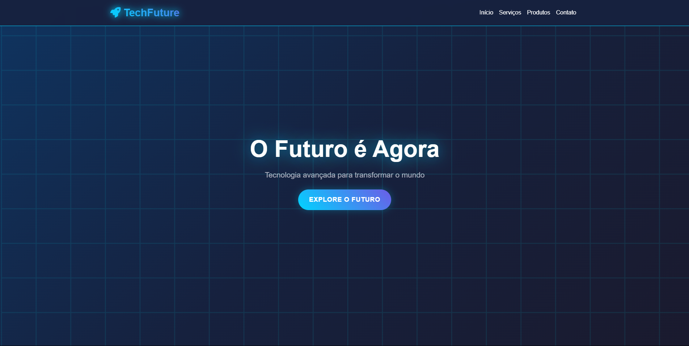

# Landing Page TechFuture 🚀

Projeto de uma landing page moderna e responsiva para uma empresa de tecnologia fictícia, a TechFuture, desenvolvida para ser totalmente adaptável a diferentes tamanhos de tela.

[🇺🇸 English Version](README.md) | [🇧🇷 Versão em Português](PT-BR-README.md)


<br>

<p align="center">
  
</p>

> ### 🔗 **[Acesse a demonstração ao vivo](https://landingpage-tech-future-responsive.vercel.app/)**

<br>

## 📋 Índice

* [Sobre](#-sobre-o-projeto)
* [Tecnologias Utilizadas](#-tecnologias-utilizadas)
* [Como Executar o Projeto](#-como-executar-o-projeto)
* [Licença](#-licença)
* [Contato](#-contato)

<br>

## 📖 Sobre o Projeto

A **Landing Page TechFuture** foi criada como um exercício prático para desenvolver uma interface moderna e profissional, focada em conversão e apresentação de uma empresa de tecnologia. O layout foi construído do zero, utilizando HTML semântico, CSS com Flexbox e Media Queries para garantir a responsividade, e JavaScript para interatividade.

**Funcionalidades destacadas:**
*   **Design Totalmente Responsivo:** Adapta-se perfeitamente a desktops, tablets e smartphones.
*   **Animações de Scroll:** Efeitos sutis de animação ao rolar a página, implementados com a biblioteca `ScrollReveal.js`.
*   **Menu Mobile Interativo:** Menu hamburguer funcional para uma navegação fluida em dispositivos menores.

<br>

## 💻 Tecnologias Utilizadas

O projeto foi desenvolvido utilizando as seguintes tecnologias:

<div style="display: inline_block"><br>
  
  
  
</div>

*   **Biblioteca JavaScript:** [ScrollReveal.js](https://scrollrevealjs.org/)

<br>

## 🚀 Como Executar o Projeto

Como este é um projeto de front-end estático, você pode executá-lo facilmente de forma local.

```bash
# Clone este repositório
$ git clone https://github.com/gabrielcamarate/landingpage-TechFuture-Responsive.git

# Acesse a pasta do projeto no seu terminal
$ cd landingpage-TechFuture-Responsive
```

Depois, basta abrir o arquivo `index.html` no seu navegador de preferência.

> **Dica:** Se você usa o Visual Studio Code, pode instalar a extensão **Live Server** para visualizar o projeto e ter recarregamento automático ao salvar alterações.

<br>

## 📝 Licença

Este projeto está sob a licença MIT. Veja o arquivo [LICENSE](LICENSE) para mais detalhes.

<br>

## 📬 Contato

Feito com ❤️ por Gabriel Camarate. Entre em contato!

[](https://www.linkedin.com/in/gabrielcamarate/)
[](mailto:gabrielcamarate@icloud.com)
[](https://github.com/gabrielcamarate)