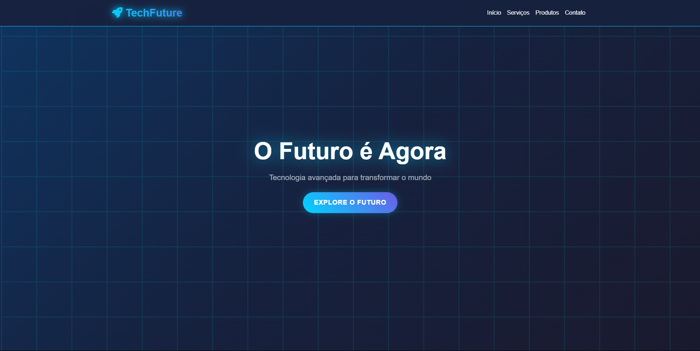

# TechFuture Landing Page 🚀

A modern and responsive landing page project for a fictional tech company, TechFuture, designed to be fully adaptable to different screen sizes.


<br>

<p align="center">
  
</p>

> ### 🔗 **[View live demo](https://landingpage-tech-future-responsive.vercel.app/)**

<br>

## 📋 Table of Contents

* [About the Project](#-about-the-project)
* [Technologies Used](#-technologies-used)
* [How to Run the Project](#-how-to-run-the-project)
* [License](#-license)
* [Contact](#-contact)

<br>

## 📖 About the Project

The **TechFuture Landing Page** was created as a practical exercise to develop a modern and professional interface, focused on conversion and showcasing a technology company. The layout was built from scratch using semantic HTML, CSS with Flexbox and Media Queries to ensure responsiveness, and JavaScript for interactivity.

**Key Features:**
*   **Fully Responsive Design:** Perfectly adapts to desktops, tablets, and smartphones.
*   **Scroll Animations:** Subtle animation effects when scrolling down the page, implemented with the `ScrollReveal.js` library.
*   **Interactive Mobile Menu:** A functional hamburger menu for smooth navigation on smaller devices.

<br>

## 💻 Technologies Used

This project was developed using the following technologies:

<div style="display: inline_block"><br>
  
  
  
</div>

*   **JavaScript Library:** [ScrollReveal.js](https://scrollrevealjs.org/)

<br>

## 🚀 How to Run the Project

Since this is a static front-end project, you can easily run it locally.

```bash
# Clone this repository
$ git clone https://github.com/gabrielcamarate/landingpage-TechFuture-Responsive.git

# Navigate to the project folder in your terminal
$ cd landingpage-TechFuture-Responsive
```

Then, simply open the `index.html` file in your preferred browser.

> **Tip:** If you use Visual Studio Code, you can install the **Live Server** extension to view the project and get automatic reloading when you save changes.

<br>

## 📝 License

This project is under the MIT license. See the [LICENSE](LICENSE) file for more details.

<br>

## 📬 Contact

Made with ❤️ by Gabriel Camarate. Get in touch!

[](https://www.linkedin.com/in/gabrielcamarate/)
[](mailto:gabrielcamarate@icloud.com)
[](https://github.com/gabrielcamarate)